
# Table of Contents

1.  [EM算法的引入](#org0fdddb7)
    1.  [EM算法](#orgd7a52a0)
    2.  [EM算法的导出](#org4d31fe9)
    3.  [EM算法在非监督学习中的作用](#org9d8a786)
    4.  [EM算法的收敛性](#orgd7f236e)
2.  [EM算法在高斯混合模型中的应用](#orgf693466)
    1.  [高斯混合模型](#orgb498e11)
    2.  [高斯混合模型参数估计的EM算法](#orge0ccd33)
3.  [EM算法的推广](#org75e3044)
    1.  [F函数的极大-极大算法](#org24f648a)
    2.  [GEM算法](#org211e9a5)

EM算法及其推广用于含有隐参数的概率模型参数的极大似然估计，或极大后验概率估计。
  迭代由两步组成：
    E步：求期望 M步：求极大

# EM算法的引入

最大似然估计需满足一个重要假设：采样是独立同分布的
最大后验概率估计：与最大似然估计类似，但最大的不同是最大后验概率估计融入了要估计量的先验分布在其中。故最大后验概率估计可以看做规则化的最大似然估计。

## EM算法

定义Q函数：
完全数据的对数似然函数 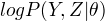关于在给定观测数据Y和当前参数 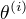 下对未观测数据Z的条件概率的期望称为Q函数， 即
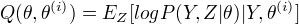

EM算法与选取的初值有关，选择不同的初值得到不同的参数估计值。
EM算法
输入：观测变量数据值Y,隐变量数据Z,联合分布 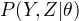, 条件分布  。
输出：模型参数 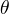 
(1)选择参数 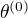 ， 开始迭代
(2)E步：记 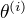 为第i次迭代参数  的估计值，在第i+1次迭代的E步，计算

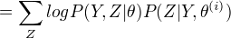
(3)M步：求使 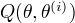 极大化的 ,确定第i+1次的估计值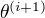
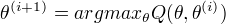
(4)重复第(2)步和第(3)步，直到收敛。
第二步中的Q函数是EM算法的核心。

## EM算法的导出

通过近似求解观测数据的对数似然函数的极大化问题来导出EM算法。看出EM算法的作用。
EM算法通过不断求解下界的极大化逼近求解对数似然函数极大化，不能保证找到全局最优值。

## EM算法在非监督学习中的作用

EM算法可以用于生成模型的非监督学习。生成模型由联合概率分布P(X,Y)表示，可以认为非监督学习训练数据是联合分布产生的数据，X是观测数据，Y是未观测数据。

## EM算法的收敛性

定理：设 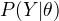 为观测数据的似然函数，
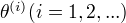 为EM算法得到的参数估计序列， 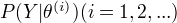 为对应的似然函数序列，则 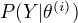 是单调递增的。

定理：&#x2026;.
定理只能保证参数估计序列收敛到对数似然函数序列的稳定点，不能保证收敛到极大值点。
常用方法是选取几个不同的初值进行迭代，然后从得到的各个估计值加以比较，从中选择最好的。

# EM算法在高斯混合模型中的应用

EM算法的一个重要应用：高斯混合模型的参数估计

## 高斯混合模型

高斯混合模型：
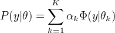
其中，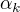 是系数， 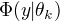 是高斯分布密度

## 高斯混合模型参数估计的EM算法

1.明确隐变量，写出完全数据的对数似然函数
隐变量：反映观测数据 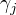 来自第k个分模型的未知数据，记为 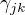
观测数据：   未观测数据 
完全数据的似然函数：
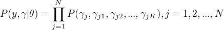 

2.EM算法的E步，确定Q函数
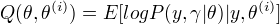     
计算 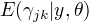 当前模型的第j个观测数据来自第k个分模型的概率， 记为 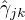 。

3.确定EM算法的M步。
用 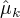 , 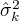 ， 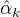 表示 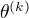 的各参数，通过偏导数为0求的值。
重复上述过程，直至对数似然函数不再有明显变化。

# EM算法的推广

EM算法还可以解释为F函数的极大-极大算法，基于这个解释有若个变形和推广  GEM

## F函数的极大-极大算法

定义： 隐变量数据Z的概率分布为 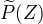 ,定义分布 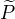 与参数  的函数 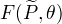 如下：
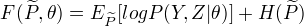 
称为F函数， 式中 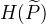 是分布  的熵。

EM算法的一次迭代可由F函数的极大-极大算法实现
(1) 对固定的  ,求 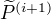 ，使得  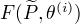 最大化。
(2) 对固定的  ,求  ,使得 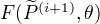 最大化。

## GEM算法

GEM算法1: EM算法的F函数方法表达
GEM算法2: 并不直接求极大，而是找到一个  使函数值变大。
GEM算法3: 参数  的维数d>=2时，将M步分解为d次条件极大化。

