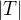

# Table of Contents

1.  [决策树模型与学习](#orgb343105)
    1.  [决策树模型](#org3a72b55)
    2.  [决策树与if-then规则](#orgd1449c2)
    3.  [决策树与条件概率分布](#org92f0826)
    4.  [决策树学习](#org2d8d98b)
2.  [特征选择](#org51e726f)
    1.  [特征选择问题](#org5051c18)
    2.  [信息增益](#org08159e4)
    3.  [信息增益比](#org4f3a51a)
3.  [决策树的生成](#org21fa7da)
    1.  [ID3算法](#orga6fbf68)
    2.  [C4.5的生成算法](#orge5aad64)
4.  [决策树的剪枝](#orge2011c3)
5.  [CART算法](#orge7679d1)
    1.  [CART的生成](#org3a8514d)
    2.  [CART剪枝](#org33c6121)

呈树形，基于特征对实例进行分类的过程。可以认为是if-then 规则的集合，或者在类空间和概率空间的条件概率分布。
通常包含3个步骤：特征选择、决策树的生成、决策树的修剪。

# 决策树模型与学习

## 决策树模型

决策树由结点和有向边组成。
结点：内部结点、叶结点
内部结点表示一个特征或属性，叶结点表示一个类。
将实例分到叶结点的类中。

## 决策树与if-then规则

if-then规则的一个重要的性质：互斥并且完备

## 决策树与条件概率分布

决策树还可以表示给定特征条件下类的条件概率分布。
决策树所表示的条件概率分布由各个单元给定条件下类的条件概率分布组成。

## 决策树学习

本质：归纳出一组分类规则。
由训练数据集归纳出条件概率模型，得到的模型应该对未知数据有较好的预测。
决策树学习的损失函数：对数似然损失
策略：以损失函数为目标函数的最小化
启发式学习方法 次最优
递归地选择最优特征，对训练数据进行分割
过拟合 剪枝 泛化能力
学习算法包含：特征选择、决策树的生成、决策树的剪枝
常用算法:ID3、C4.5、CART

# 特征选择

## 特征选择问题

特征选择的准则：信息增益和信息增益比。

## 信息增益

熵：随机变量不确定性的度量
设X是一个取有限个值的离散随机变量，其概率分布为：

则随机变量X的熵定义为：

熵只依赖于X的分布，而与X的取值无关，可将X的熵记为H(p)
熵越大，随机变量的不确定性越大

条件熵H(Y|X)表示在已知随机变量X的条件下随机变量Y的不确定性。

当熵和条件熵中的概率由数据估计得到时，所对应的熵和条件熵分别称为经验熵和经验条件熵。

信息增益表示得知特征X的信息而得到类Y的不确定性减少的程度。
定义为集合D的经验熵H(D)与特征A给定的条件下D的经验条件熵H(D|A)之差(互信息)：
  
决策树学习应用信息增益准则来选取特征，表示在特征A给定的条件下对数据集D进行分类的不确定性。
特征选择方法：计算各特征的信息增益，选择信息增益最大的特征。

## 信息增益比

以信息增益作为划分训练数据集的特征，存在偏向于选择取值较多的特征的问题，使用信息增益比进行校正。
信息增益比  定义为信息增益  与训练数据集关于特征A的值的熵  之比。其中，  。

# 决策树的生成

## ID3算法

核心：在决策树各个结点上应用信息增益准则选取特征，递归得构建决策树。
ID3相当于用极大似然法进行概率模型的选择。
只有树的生成，容易产生过拟合。

## C4.5的生成算法

对ID3进行改进，用信息增益比选择特征。

# 决策树的剪枝

通过极小化决策树整体的损失函数或代价函数来实现。
决策树的损失函数可以定义为：
  
其中经验熵：
  
   : 叶结点有  个样本点。
树T的叶结点个数为|T|
损失函数的极小化等价于正则化的极大似然估计

树的剪枝算法
  递归地从叶结点向上回缩，若损失函数减小，则进行剪枝。
  计算可在局部进行，可由动态规划算法实现。

# CART算法

CART 分类与回归树
CART:在给定输入随机变量X条件下输出随机变量Y的条件概率分布的学习方法。
包含两个步骤：决策树的生成、决策树剪枝

## CART的生成

回归树：平方误差最小化
分类树：基尼系数最小化

回归树的生成
假设将输入空间划分为M个单元，每个单元上有一个固定的输出值,于是回归模型可表示为：

当输入空间划分确定时，可以用平方误差  来表示回归树对于训练数据的预测误差，用平方误差最小原则求解每个单元的最优输出值。
单元  上的  的最优值  是  上的所有输入实例  输出的均值。

对输入空间进行划分，启发式：
选择第j个变量  和它取的值s,作为切分变量和切分点，寻找最优的切分变量和切分点，将输入空间划分为两个区域，对每个子区域重复上述过程，直至满足条件。

分类树的生成
定义基尼指数：

对于给定的样本集合D,其基尼指数为

 是D中属于第k类的样本子集， K是类的个数。
若样本集合根据特征A是否取a被划分为  和  ，则在特征条件A下，集合D的基尼指数定义为：

基尼指数表示集合的不确定性，基尼指数越大，集合的不确定性越大。
基尼指数和熵之半的曲线很接近，都可以近似地代表分类的误差率。

CART生成算法
对所有特征的每个取值计算基尼指数，选择基尼指数最小的特征及其所对应的切分点作为最优特征和最优切分点，将训练数据分为两个子结点中。重复直至满足条件。

## CART剪枝

从完全生长的决策树底端剪去一些子树。
由两步组成:
  从底端开始不断剪枝，直到根结点，形成子树序列；
  通过交叉验证法在独立的验证集上对子序列进行测试，从中选取最优子树。

1.剪枝，形成一个子树序列
  
   为对训练数据的预测误差(如基尼指数)，  为子树的叶结点的个数，  为权衡训练数据拟合程度和模型复杂度， 为参数为  时的子树T的整体损失。 
  用递归的方法进行剪枝，将  从小增大，得到临界点的  的值， , 产生一系列的区间 , 对应的最优子树序列  。
2.在剪枝得到的子树序列张通过交叉验证选取最优子树 
  利用独立数据集，测试子树序列的平方误差或基尼系数，最小的决策树被认为是最优的决策树。

