
# Table of Contents

1.  [线性可分支持向量机和硬间隔最大化](#org27f0bed)
    1.  [线性可分支持向量机](#org980f0bb)
    2.  [函数间隔和几何间隔](#orgeafba70)
    3.  [间隔最大化](#org3bdbf58)
        1.  [最大间隔分离超平面](#org4e8a741)
        2.  [支持向量和间隔边界](#org3da9ba0)
        3.  [学习的对偶算法](#org2b86260)
2.  [线性支持向量机与软间隔最大化](#orgf420949)
    1.  [线性支持向量机](#orgbceeb29)
    2.  [学习的对偶算法](#orgd12c101)
    3.  [支持向量](#orgf681033)
    4.  [合页损失函数](#org11248cc)
3.  [非线性支持向量机和核函数](#orgbd90db6)
    1.  [核技巧](#org61bddf2)
    2.  [正定核](#org1d0f222)
    3.  [常用核函数](#org8736797)
    4.  [非线性支持向量分类机](#orgb281b9b)
4.  [序列最小最优化算法](#orga9dd2bf)
    1.  [两个变量二次规划的求解方法](#org1d7239e)
    2.  [变量选择的方法](#org9019346)

在特征空间间隔最大大的线性分类器。
核技巧，非线性分类器
学习策略：间隔最大化m
学习算法是求解凸二次规划的最优化算法

模型：线性可分支持向量机、线性支持向量机、非线性支持向量机（由简到繁）
训练数据线性可分 硬间隔最大化 线性可分支持向量机
训练数据近似可分  软间隔最大化  线性支持向量机 
训练数据线性不可分  核技巧和软间隔最大化  非线性支持向量机

输入空间是欧式空间或者离散集合、特征空间是希尔伯特空间时，核函数：将输入从输入空间映射到特征空间得到特征向量之间的内积。
核方法是比支持向量机更为一般的机器学习方法。

# 线性可分支持向量机和硬间隔最大化

## 线性可分支持向量机

利用间隔最大化求最优分离超平面，解唯一。

## 函数间隔和几何间隔

函数间隔
样本点 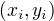 的函数间隔：
  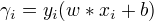
关于训练集的函数间隔：
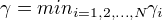
对w进行约束，||w|| = 1,函数间隔变成几何间隔

## 间隔最大化

### 最大间隔分离超平面

线性可分支持向量机学习的最优化问题：
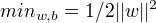
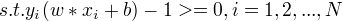
最大间隔分离超平面的存在具有唯一性

### 支持向量和间隔边界

训练样本点与分离超平面距离最近的实例为支持向量

### 学习的对偶算法

优点：对偶问题往往更容易求解、自然引入核函数，推广到非线性分类
根据拉格朗日对偶性，原始问题的对偶问题是极大极小问题：
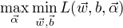
为了得到对偶问题的解，需要先求 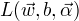 对 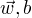的极小化，接着求对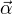的极大化。
与之等价的对偶最优化问题：
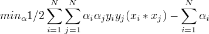
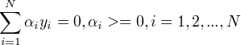
分类决策函数只依赖于输入x和训练样本输入的内积

对于给定的线性可分训练集，通过对偶问题求得w,b, 得到分离超平面和分类决策函数。这种方法是线性可分支持向量机的基本学习算法。

w,b只依赖于训练样本中对应于 $&alpha;i > 0 $ 的样本点，将这样的点称为支持向量。

# 线性支持向量机与软间隔最大化

## 线性支持向量机

引入松弛变量 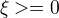,使函数间隔加上松弛变量大于等于0，约束条件变为：
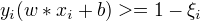
目标函数变为：
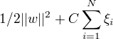
C > 0称为惩罚参数
使 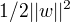 尽量小即间隔尽量大，使误分类的额个数尽量小
线性不可分的线性支持向量机学习的原始问题：
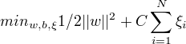
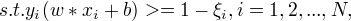
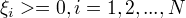
可以证明w的解是唯一的，b的解不唯一，存在一个区间

## 学习的对偶算法

原始问题对应的对偶问题不变，满足的条件发生改变 $ 0<= &alpha;i <= C, i=1,2,&#x2026;N$

## 支持向量

软间隔的支持向量或者在间隔的边界上，或者在间隔边界与分离超平面之间，或者在分离超平面误分类一侧。

## 合页损失函数

线性支持向量机学习，模型：分离超平面及决策函数，学习策略：软间隔最大化，学习算法：凸二次规划
另一种解释，最小化如下目标函数：
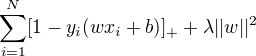
目标函数的第一项称为经验损失，第一项称为合页损失函数，第二项是正则化项。

# 非线性支持向量机和核函数

## 核技巧

核技巧通过一个非线性变换将输入空间对应与一个特征空间。分类任务在特征空间求解线性支持向量机。
存在输入空间到特征空间的映射
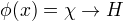 
使得对所有的 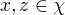 ,函数K(x,z)满足条件
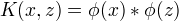
则称K(x,z)为核函数(任意两个输入变量在高维映射中的内积)， 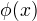 为映射函数。
核技巧：只定义核函数，而不显示地定义映射函数。直接计算核函数容易，而通过映射函数计算复杂。
对于给定的核函数，特征空间和映射函数大的取法不唯一。

核技巧在支持向量机中的应用
在对偶的目标函数中的内积 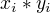 可以用核函数 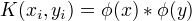 来代替，同时分类决策函数中的内积也可以用核函数来代替。

## 正定核

K(x,z)为对称函数，则K(x,z)为正定核函数的充要条件是对任意的 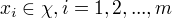 K(x,z)对应的Gram矩阵：
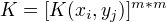
是半正定矩阵。
检验是否是正定核函数并不容易。

## 常用核函数

多项式核函、高斯核函数、字符串核函数
字符串核函数：两个字符串相同的子串越多，他们就越相似，字符串核函数的值就越大。可以由动态规划快速计算。

## 非线性支持向量分类机

将线性支持向量机扩展到非线性支持向量机，只需将线性支持向量机对偶形式中的内积换成核函数。

非线性支持向量机学习算法
（1）选取适当的核函数K(x,z)和适当的参数C，构造并求解最优化问题
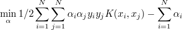
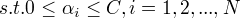
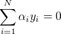
求得最优解 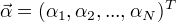
选取 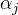 求
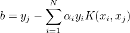
构造决策函数
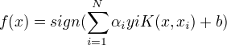

# 序列最小最优化算法

SMO算法：若所有变量的解都满足KKT条件，则解就得到了；否则，选择两个变量，固定其他变量，构建二次规划问题并求解，将原问题不断分解为子问题并对子问题求解，进而求解原问题。
包含：求解两个变量二次规划的解析方法、选择变量的启发式方法

## 两个变量二次规划的求解方法

## 变量选择的方法

第1个变量的选择
外层循环选取违背KKT条件最严重的点，首先遍历在间隔边界上的支持向量的点，检验是否满足条件，若都满足条件，则遍历整个训练集，检验是否满足条件。
第2个变量的选择
选择的标准，使第二个变量有足够大的变化

