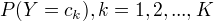
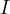

# Table of Contents

1.  [朴素贝叶斯法的学习和分类](#orgdaceca1)
    1.  [基本方法](#org34fb153)
2.  [朴素贝叶斯法的参数估计](#org836ff19)
    1.  [极大似然估计](#org0e52736)
    2.  [学习和分类算法](#org3e9f016)

朴素贝叶斯法：基于贝叶斯定理与特征条件独立假设的分类方法
首先，根据特征条件独立假设学习输入/输出的联合概率分布
然后，基于模型，对给定的x,利用贝叶斯定理求出后验概率最大的输出y

实现简单，学习和预测的效率高

# 朴素贝叶斯法的学习和分类

## 基本方法

通过训练集数据学习联合概率分布P(X, Y), 学习：
先验概率分布: 
条件概率分布：

做了条件独立性的假设，因而得名朴素。
学习生成数据的机制，因而属于生成模型。

根据学得的模型，对给定输入x,将后验概率最大的类作为x的类输出。

# 朴素贝叶斯法的参数估计

## 极大似然估计

应用极大似然估计法估计相应的概率：   和 
先验概率  的极大似然估计是

 : 指示函数，表示有哪些元素属于某一子集A。

## 学习和分类算法

计算条件概率分布和先验概率分布，对于给定的x,将后验概率最大的类作为x的类输出。

条件概率的贝叶斯估计：解决极大似然估计出现的概率值为0的情况。

若假设条件之间存在概率依存关系，朴素贝叶斯模型将变成贝叶斯网络。

