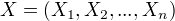

# Table of Contents

1.  [概率无向图模型](#orgee522d5)
    1.  [模型定义](#org0dde92d)
    2.  [概率无向图的因式分解](#org4ca8859)
2.  [条件随机场的定义和形式](#org8e3515a)
    1.  [条件随机场的定义](#org6b438bc)
    2.  [条件随机场的参数化形式](#org6437a32)
    3.  [条件随机场的简化形式](#org86c6352)
    4.  [条件随机场的矩阵形式](#orgc1806ff)
3.  [条件随机场的概率计算问题](#org852f08c)
    1.  [前向-后向算法](#org9b4fa8b)
    2.  [概率计算](#orgc2e331f)
    3.  [期望值计算](#org6e93054)
4.  [条件随机场的学习算法](#org0c12d86)
    1.  [改进的迭代尺度法](#orge366cf6)
    2.  [拟牛顿法](#orgd48cd8b)
5.  [条件随机场的预测算法](#org0a46352)

条件随机场(CRF)是给定一组输入随机变量条件下另一组输出随机变量的条件概率分布模型。
特点：假设输出随机变量构成马尔科夫随机场。
主要讲述线性链条件随机场

# 概率无向图模型

又称为马尔科夫随机场，可以由无向图表示的联合概率分布。

## 模型定义

无向图表示的随机变量之间存在成对马尔科夫性、局部马尔可夫性、全局马尔科夫性。
成对马尔可夫性：u,v是没有边连接的结点，O是其他结点，给定随机变量组  的条件下随机变量  和  是条件独立的。
局部马尔可夫性：W是与v有边连接的结点，O是其他结点，给定随机变量组  的条件下随机变量  和  是条件独立的。
全局马尔可夫性：点集合A,B是被C分开的任意结点集合，给定随机变量组  的条件下随机变量组  和  是条件独立的。

概率无向图模型定义：
结点表示随机变量，边表示依赖关系。若联合概率分布P(Y)满足成对马尔可夫性、局部马尔可夫性、全局马尔可夫性，就称此联合概率分布为概率无向图模型，或马尔科夫随机场。
求解马尔科夫模型：将联合概率进行因式分解。

## 概率无向图的因式分解

定义团和最大团
概率无向图的因式分解：将无向图模型的概率分布表示为最大团上的随机变量函数的乘积形式
给定无向图概率模型，设其无向图为G，C为G上的最大团， 表示C对应的随机变量。那么概率无向图模型的联合概率分布P(Y)可写作图中所有最大团C上的函数  的乘积形式，即
 
其中， Z是规范化因子，由式
 
给出。保证P(Y)构成一个概率分布。函数  称为势函数，要求势函数严格为正。

# 条件随机场的定义和形式

## 条件随机场的定义

条件随机场（CRF）是给定随机变量X的条件下，随机变量Y的马尔科夫随机场。
线性链条件随机场： 用于标注等问题
   条件概率模型P(Y|X)，Y是输出变量（状态序列）， X是输入变量（观测序列）。学习时，通过（正则化）极大似然估计得到条件概率P(Y|X)。预测时，对于给定的输入序列x,求出条件概率  最大的输出序列  .
   条件随机场的定义
   设X与Y是随机变量，P(Y|X)是在给定X的条件下Y的条件概率分布，若随机变量Y构成一个由无向图G=(V,E)表示的马尔科夫随机场，则称条件概率分布P(Y|X)为条件随机场。
   定义中未要求X和Y有相同的结构，现实中一般假设有相同的图结构。

线性链条件随机场的定义
设  ，  均为线性链表示的条件随机序列，若给定条件随机序列X的条件下，随机变量序列Y的条件分布序列  构成条件随机场，即满足马尔可夫性，则称P(Y|X)为线性链条件随机场。

## 条件随机场的参数化形式

设P(Y|X)为线性链条件随机场，则在随机变量X取值为x的条件下，随机变量Y取值为y的条件概率具有如下形式：
 
其中，

 为转移特征，   为状态特征，取值为0或者1；  为对应的权值。
例11.1    1+ 0.2 + 1 + 0.5 + 0.5 = 3.2

## 条件随机场的简化形式

同一特征在各个位置都有定义，对同一特征在各个位置求和，将局部特征函数转化成一个全局特征函数，将条件随机场写成权值向量和特征向量的内积形式。
先将转移特征和状态特征用统一的符号  表示。
然后，对转移和状态特征在各个位置上求和。
接着用统一的符号  表示特征  的权值。
于是，条件随机场可以表示为：

若以向量表示为：

## 条件随机场的矩阵形式

# 条件随机场的概率计算问题

给定条件随机场P(Y|X),输入序列x和输出序列y,计算条件概率  以及相应的数学期望的问题。

## 前向-后向算法

定义前向变量  ,  表示在位置i的标记是  并且到位置i 的前部分标记序列的非规范化概率。  可取m个，  是m维向量。
定义后向变量  ,  表示在位置i的标记为  并且从 i+1 到 n的后部分标记序列的非规范化概率。

可得：

## 概率计算

  

## 期望值计算

# 条件随机场的学习算法

模型：定义在时序数据上的对数线性模型
学习方法：（正则化的）极大似然估计

## 改进的迭代尺度法

## 拟牛顿法

# 条件随机场的预测算法

维特比算法

