
# Table of Contents

1.  [逻辑斯蒂回归](#org315af04)
    1.  [逻辑斯蒂分布](#org9e9f8ab)
    2.  [二项逻辑斯蒂回归模型](#org6c1052c)
    3.  [模型参数估计](#org2571c0b)
    4.  [多项logistic regression](#orgdab6d9f)
2.  [最大熵模型](#org5171b0a)
    1.  [最大熵原理](#org65f9d6b)
    2.  [最大熵模型的定义](#org3ebc6b8)
    3.  [最大熵模型的学习](#org6caeb13)
    4.  [极大似然估计](#orgcad86ac)
3.  [模型学习的最优化算法](#org0a7ad60)
    1.  [改进的迭代尺度法(IIS)](#org8c06125)
    2.  [拟牛顿法](#org08fa910)

逻辑斯蒂回归与最大熵模型都属于对数线性模型

# 逻辑斯蒂回归

## 逻辑斯蒂分布

## 二项逻辑斯蒂回归模型

定义：
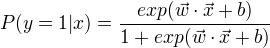
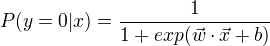
比较两个条件概率的大小，将实例x分到条件概率值较大的那一类。
对数几率或logit函数是：
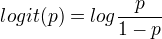
在logistic regression模型中，输出 Y=1 的对数几率是输入x的线性函数
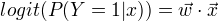

## 模型参数估计

应用极大似然估计法估计模型的参数
设: 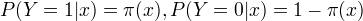
似然函数为：
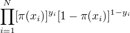
对数似然函数为：
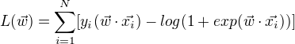
对对数似然函数求极大值，得到 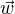 的估计值。
问题变成以对数似然函数为目标函数的最优化问题。
通常采用梯度下降法和拟牛顿法。

## 多项logistic regression

# 最大熵模型

由最大熵推导实现

## 最大熵原理

假设离散随机变量X的概率分布为P(X)，则其熵为：
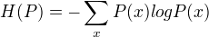 
熵最大的模型为最好的模型。
最大熵原理通过熵的最大化来表示等可能性。

## 最大熵模型的定义

对于给定的输入X,以条件概率P(Y|X)输出Y。
学习的目标:用最大熵原理选择最好的分类模型。
最大熵模型
  定义在条件概率分布P(Y|X)上的条件熵为：
    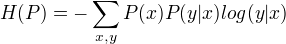 
则满足所有约束条件的模型集合为C中条件熵H(P)最大的模型称为最大熵模型。

## 最大熵模型的学习

形式化为约束最优化问题，将约束最优化问题转换为无约束最优化的对偶问题，通过解对偶问题求解原问题。
最大熵模型：
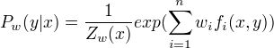
其中，
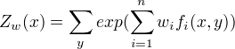
特征函数为 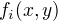 ， 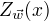 称为规范化因子， n为特征函数的个数， 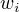 为特征的权值。

## 极大似然估计

证明了最大熵模型学习中的对偶函数的极大化等价于最大熵模型的极大似然估计
最大熵模型的一般形式
  
其中
  
  这里 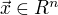 为输入， 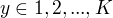 为输出， 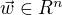 为权值向量，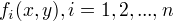 为任意实值特征函数。

# 模型学习的最优化算法

logistic regression、最大熵模型学习归结为以似然函数为目标函数的最优化问题，通常通过迭代法求解。能保证找到全局最优解，牛顿法和拟牛顿法收敛速度快。

## 改进的迭代尺度法(IIS)

当前的参数向量是 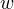,找到一个新的参数向量 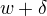,使得模型的对数似然函数增大，重复这一过程，直至找到对数似然函数的最大值。

## 拟牛顿法

最大熵模型：
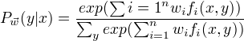
目标函数（熵最大化）：
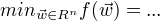
梯度：
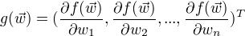

算法：
(1)选定初始点 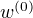 ,取 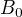 为正定对称矩阵，置k=0
(2)计算 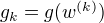 , 若 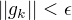 ,则停止计算， 得 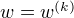 ; 否则转到(3)
(3)由 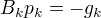 求出 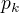 。
(4)一维搜索：求 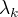 使得
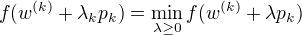
(5)置 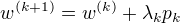
(6)计算 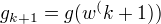 , 若 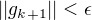 , 则停止计算, 得 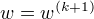 ; 否则， 按下式求出 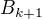 :
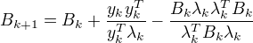
其中，
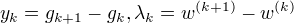
(7)置 k = k +1, 转(3).

