
# Table of Contents

1.  [马尔科夫模型的基本概念](#org0a9bceb)
    1.  [隐马尔科夫模型的定义](#org62d3668)
    2.  [观测序列的生成过程](#org758e5d9)
    3.  [隐形马尔科夫模型的3个基本问题](#orgb7fbae2)
2.  [概率计算算法](#org0496eee)
    1.  [直接计算法](#orgc233457)
    2.  [前向算法](#org3ead18e)
    3.  [后向算法](#org717106c)
    4.  [一些概率与期望值的计算](#org732893f)
3.  [学习算法](#org6e5bad9)
    1.  [监督学习方法](#org8dd9a0c)
    2.  [Baum-Welch算法(EM算法)](#org2701657)
    3.  [Baum-Welch 模型参数估计公式](#org865377c)
4.  [预测算法](#orge750278)
    1.  [近似算法](#org0749145)
    2.  [维特比算法](#org62a6781)

隐形马尔科夫模型可用于标注问题的统计学习的模型，描述由隐形的马尔科夫链随机生成观测序列的过程,属于生成模型。在语音识别、自然语言处理、生物信息、模式识别等领域有广泛的应用。

# 马尔科夫模型的基本概念

## 隐马尔科夫模型的定义

 定义：隐马尔科夫模型是关于时序的概率模型，描述由一个隐藏的马尔科夫链随机生产不可观测的状态随机序列，再由各个状态生成一个观测而产生观测随机序列的过程。隐形的马尔科夫链随机生成的状态的序列，称为状态序列；每个状态产生一个观测，而由此产生的观测的随机序列，称为观测序列。序列的每一个位置又可以看作一个时刻。
 隐形马尔科夫模型由初始概率分布、状态转移概率分布、以及观测概率分布确定。
 形式定义：
 Q是所有可能的状态的集合，V是所有可能的观测的集合。
 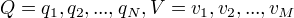
 N：可能的状态数           M:可能的观测数
 I是长度为T的状态序列，O是对应的观测序列。
 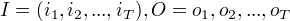
 A是状态转移概率矩阵：
 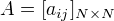
其中，
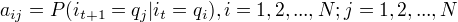 
是在时刻t处于状态 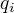 在时刻t+1跳转到状态 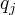 的概率。
B是观测概率矩阵：
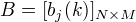
其中，
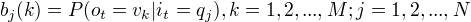
是在时刻t处于状态  的条件下生成观测 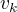 的概率。
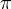 是初始状态概率向量：
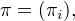
其中，
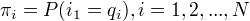
是在时刻t=1处于状态  的慨率。

隐形马尔科夫模型由初始概率向量  、状态转移概率矩阵A和观测概率矩阵B决定。 和A决定状态序列，B决定观测序列。因此，隐形马尔科夫模型 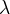 可以用三元符号表示，即
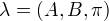
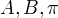 称为隐形马尔科夫模型的三要素。
齐次马尔可夫假设：每一时刻只依赖于前一时刻
观测独立性假设：观测只依赖于马尔科夫链的状态

## 观测序列的生成过程

## 隐形马尔科夫模型的3个基本问题

(1)概率计算问题
    给定模型  和观测序列O，计算 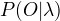 。
(2)学习问题
    已知观测序列O,估计模型  参数， 使  最大 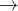 极大似然估计 。
(3)预测问题
    给定模型  和 观测序列  , 求最有可能的对应的状态序列 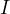 。

# 概率计算算法

前向算法、后向算法

## 直接计算法

概念上可行，计算上不可行
按概率公式直接计算，计算量大， 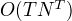 阶。

## 前向算法

前向概率定义：给定马尔科夫模型，定义到时刻t部分观测序列为 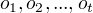 且状态为  的概率为前向概率，记作
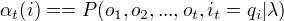 
可以递归地求出前向概率 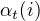 及观测序列概率  。

观测序列概率的前向算法
(1)初值
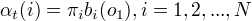
(2)递推 对 t = 1,2,&#x2026;, T -1
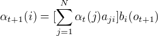 
(3)终止
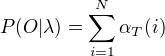
每一次计算直接引用前一个时刻的计算结果，避免重复计算。 计算量 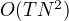 阶，直接计算是 阶。

## 后向算法

## 一些概率与期望值的计算

# 学习算法

根据训练数据包含观测序列和对应的状态序列还是只有观测序列，可以分别由监督学习和非监督学习实现。

## 监督学习方法

用极大似然估计来估计隐马尔科夫模型的参数。
1.转移概率 $aij $ 的估计
设样本中时刻t处于状态i，时刻t+1转移到状态j的频数为 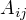 ,那么状态转移概率 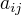 的估计是
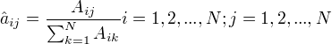
2.观测概率 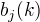 的估计
设样本中的状态为j并观测为k的频数为 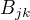 ，那么状态为j观测为k的概率为
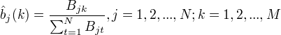
3.初始状态概率的估计 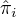 作为S个样本中初始状态为  的频率。

## Baum-Welch算法(EM算法)

人工标记代价高 非监督学习方法

给定观测序列，无状态序列，目标：学习隐马尔科夫模型的参数。
EM算法学习实现：
观测数据：观测序列数据O
不可观测隐数据：状态序列数据I
对数似然函数：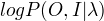

EM算法的E步：求Q函数 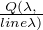 。
EM算法的M步：极大化Q函数求  。

## Baum-Welch 模型参数估计公式

# 预测算法

## 近似算法

在每一时刻，选择最有可能发生的状态，作为预测结果。
优点：计算简单
缺点：不能保证预测的状态序列整体是最有可能的状态序列。

## 维特比算法

用动态规划解隐马尔科夫模型预测问题。
部分最优路径唯一，通过递推分割由部分最优达到全局最优。

定义在时刻t状态为i的所有单个路径 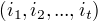 中概率最大值为
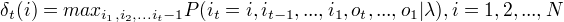
由定义可得变量 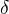 的递推公式：
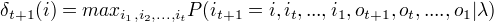
	 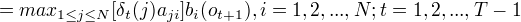
定义在时刻t状态为i的所有单个路径中概率最大的路径的第t-1个结点为 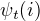 :用于找出最优路径的各个结点。
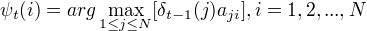

算法
(1)初始化
(2)递推
(3)终止
(4)最优路径回溯

